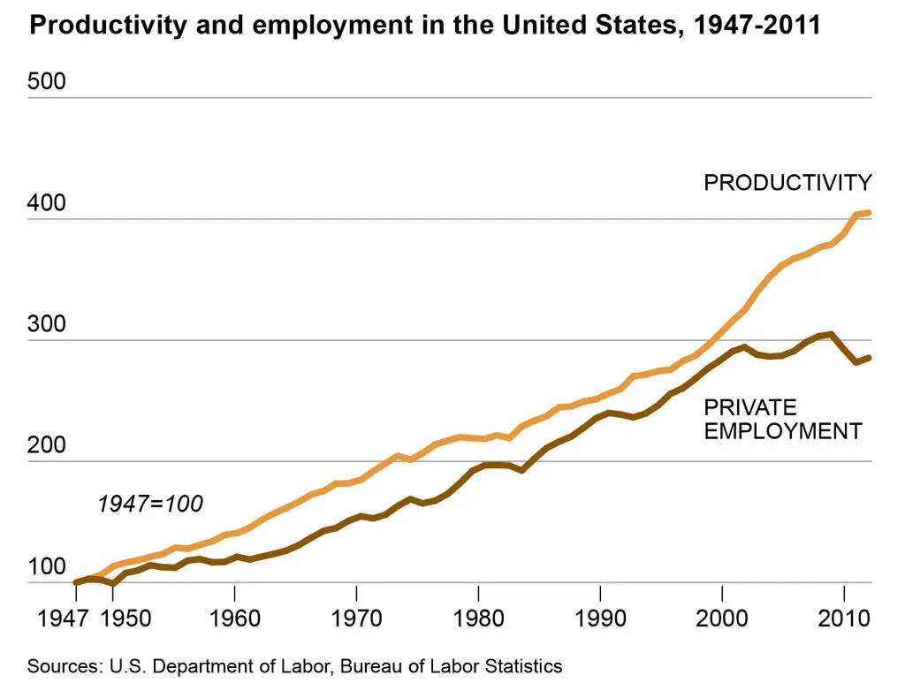
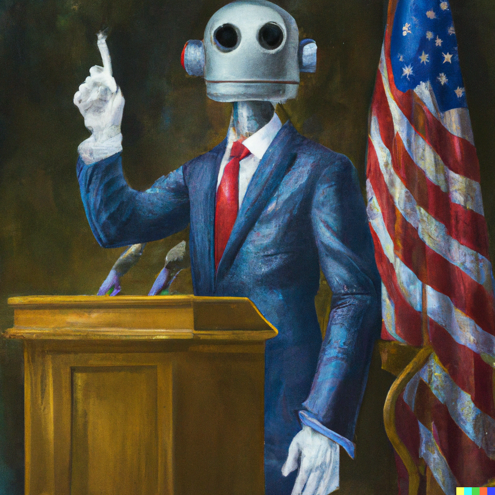

# Post Labor
Timeline predictions of breakthrough technology are notoriously unreliable; but I think it is worth thinking about them before they arrive. In this post we will discuss the idea that automation will lead to a post labor economy in which labor is not longer required to turn capital in to wealth. The upends much of the macro economic theories the underpin both socialist and capitalist systems.

# Decoupling
One might argue that automation has played role of driving labor out of industries for centuries. 

European farming in the 1800s [accounted for well over 50%](https://ourworldindata.org/employment-in-agriculture) of the work force where today it is around 3%. This drop is not driven just by growing populations but by drastic reductions in the number of people employed in the industry. This was a drastic realignment of the economies but it was accompanied by a lateral move with most of the [workforce switching into services and industry](https://www.minnpost.com/macro-micro-minnesota/2012/02/history-lessons-understanding-decline-manufacturing/).

Where todays automation is different, might it still just be a move of the workforce and not and end to labor? I believe the answer is no, this change is different.

Seance it's recovery from the great recession (2007-2009) the United States has seen a sharp decoupling of productivity, employment, and wages. This effect has been dubbed [The Great Decoupling](https://www.nytimes.com/2012/12/12/opinion/global/jobs-productivity-and-the-great-decoupling.html) 

I believe this decoupling is driven by a shift from automating maniacal processes to automating knowledge.

# Knowledge Automation
The history of knowledge is ruffly: oral traditions, written language, the printing press, bureaucracy, information technology (IT), and now AI. Each change led to new efficiencies which drove productivity, but a significant change happened with the introduction of information technology. 

Prior to introduction IT the changes allowed people better, recorded, disseminate, and organism information; but information technology was automation of data **processing**. 

One of the largest effects of automation of data processing was the collapse of the large bureaucracy that historically had managed information.  Bureaucracies processed information with people and filing systems which were replaced by database systems. A database could replace entire buildings of people and filing cabinets with a hand full servers and people. Event more astounding the rate of improvement in our IT systems which fallowing Moore's Law were doubling in capability every 24 months.

The weakness of databases and IT systems was that they worked only information and not knowledge. With information one can sum a number, count words, and average balances; but these are all quantitative questions. In contrast questions of knowledge are categorical.

>**Information is quantitative where knowledge is categorical.**

# The power of knowledge
The power of categorical information is transformative. 

Image generation systems such as OpenAI's [DALL-E](https://labs.openai.com/) let us ask for images with english prompts with impressive results:

>"A realistic painting of a robot lawyer arguing for AI rights to the supreme court of the united states."

Here DALL-E "understood" the catagories of "painting", "robot", "arguing", and "United States court", etc.

[ChatGTP](https://openai.com/blog/chatgpt/), also from OpenAI, can generate text responses instead of images:

>prompt: Tell me a story of how spirits gave humans the knowledge of spinning yarn

>Long ago, in a time before humans knew how to spin yarn, the spirits of the earth, air, water, and fire came together to teach them this valuable skill.
>
>The earth spirit taught them how to collect and prepare the fibers from plants and animals, showing them which plants had the strongest and most durable fibers, and how to extract and clean the fibers so they could be used to make yarn.
>
>The air spirit taught them how to spin the fibers into yarn using a spinning wheel, showing them how to hold the fibers tightly and how to use the wheel to twist the fibers into a strong and consistent yarn.
>
>The water spirit taught them how to dye the yarn using natural dyes from plants and flowers, showing them how to mix the dyes to create different colors and how to use the dyes to add color and pattern to the yarn.
>
>Finally, the fire spirit taught them how to use the yarn to weave and knit fabrics, showing them how to use looms and needles to create beautiful and functional garments, blankets, and other items.
>
>With the help of the spirits, humans learned how to spin yarn and use it to create all kinds of useful and beautiful things. And they were forever grateful to the spirits for sharing their knowledge and wisdom with them.

Here ChatGTP understands the category of "a story about spirits", and "giving gifts", and of "fiber crafts".

In both these examples the results are synthesized from learned catagories. This is a fundamental shift for the types of quantitative questions and answers that computer systems are capable of.

Systems like DALL-E and ChatGTP are impressive, but progress in this field is not new. Automated automated legal discovery to [replace teams of lawyers](https://www.nytimes.com/2011/03/05/science/05legal.html), and in the medical field [computer-aided diagnosis](https://en.wikipedia.org/wiki/Computer-aided_diagnosis) is a decades old field of research.  

Automated knowledge is already here and a growing driver for productivity.

# Automated Knowledge effects on labor

Knowledge automation fundamentally different than automating a process. Each time we automate a process it requires a new machine, a thresher for separating wheat from chaff, a automated loom to make cloth, or train to move goods. In contrast building knowledge systems is limited largely by the need to collect examples to train on. The machine can largely remain unchanged while working in a large number of different domains. As we have more advanced knowledge systems there effects are cross cutting, effecting the entire economy and not one vertical at a time.

Postulating about the future, we can imagine a time when no, or almost no, people are required to turn some capital, a farm, a mine, or a factory, into wealth. A dystopia where a small percentage of the population receives the bounty of the planet while the vast majority are left to survive on scraps.

This doom, or coming closer to it than we already are, may not be the only option thou. 

Automation seems to also reduce the need for scale to deliver efficiency. Corporations reduced there head count when them moved form filing cabinets to database servers. CNC tool are making small production manufacturing economic in the U.S. And the web and automated package handling has given new life to small manufactures and artisans.

Tt is possible that automation will remove the advantages of scale that are one of the drivers of the concentration of capital in to the hands of the few, averting the dystopia of vastly unequal holding of wealth.

# Conclusion

As automaton of knowledge continues, there will be a dramatic shift in society as fewer and fewer people are needed in the labor market. It is my expectation that this will happen simultaneously across industries leaving few changes for people to seek new employment in different jobs. This will necessitate new social contracts and a change in our couture's relation to work. 